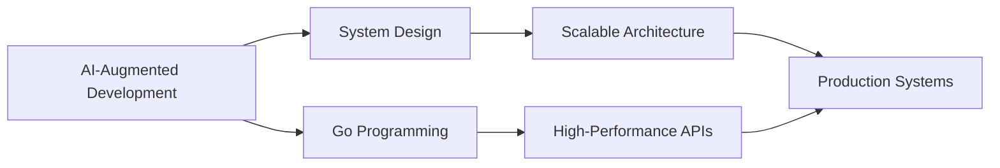

<div align="center">
  
# 👋 Hello, I'm Avishek Roy

### System-Driven Software Engineer | AI-Augmented Development | Security-Conscious Builder

[](https://linkedin.com/in/avishek-roy)
[](https://github.com/alpha101001)
[](https://leetcode.com/x64bit)
[](https://tryhackme.com/p/64bitX)
[](mailto:csekuet.avi.053@gmail.com)

</div>

---

## 🚀 About Me

I'm a **Software Engineer** passionate about building scalable, secure, and high-performance applications. Currently architecting next-gen web experiences at **Shadhin Music**, where I leverage **AI-assisted development workflows** and deep systems thinking to accelerate the SDLC and deliver production-ready software.

```typescript
const avishek = {
  location: "Dhaka, Bangladesh 🇧🇩",
  currentRole: "Software Engineer @ Shadhin Music",
  focus: ["Backend Architecture", "Full-Stack Development", "AI-Augmented Engineering"],
  philosophy: "Build robust systems. Leverage AI. Never compromise on security.",
  currentlyLearning: ["Advanced System Design", "Go (Golang)", "Agentic AI Workflows"],
  funFact: "Ranked 48th in CTF competitions & solved 130+ LeetCode problems 🧩"
};
```

---

## 💼 Professional Journey

### 🎵 **Shadhin Music** — *Software Engineer* <sub>(Aug 2025 - Present)</sub>
- 📈 Boosted **Google Lighthouse score from 42 to 85** through AI-assisted performance optimization
- 🔍 Scaled SEO visibility: **2 → 500+ discoverable pages** via dynamic rendering systems
- 🛡️ Built secure, responsive interfaces with **Zustand** state management & robust API integration

### 🏢 **Lynorg Technologies Limited** — *Software Engineer* <sub>(Jan 2025 - Jul 2025)</sub>
- ⚡ Architected **real-time data sync** features using WebSockets for enterprise ERP solutions
- 🎨 Developed complex data-driven interfaces with **React, TypeScript & Ant Design**
- 🔄 Optimized component tree rendering for massive datasets

### 🌐 **Sense & Response Software LLC** — *Software Engineer (Remote, USA)* <sub>(Jun 2024 - Dec 2024)</sub>
- 🔧 Established **code standardization practices** (ESLint) reducing production bugs significantly
- ⚡ Optimized app architecture through **code-splitting** & AI-assisted debugging
- 🛠️ Built scalable React applications with TypeScript

### 💻 **Freelance** — *Frontend Developer (Remote, USA)* <sub>(Jun 2022 - May 2024)</sub>
- 📋 Managed complete **SDLC** for clients from requirements to deployment
- 🏗️ Designed custom component architectures with focus on security & maintainability

---

## 🛠️ Tech Stack

### **AI & Agentic Engineering**


### **Languages**


### **Frameworks & Libraries**


### **Databases & Infrastructure**


### **Security & Core Engineering**


---

## 📊 GitHub Stats

<div align="center">
  


</div>

---

## 🏆 Featured Projects

### 🎵 **Shadhin Music – Performance & SEO Overhaul**
**Tech:** Next.js • JavaScript • Tailwind CSS • Zustand
- Boosted Lighthouse score **42 → 85**
- Scaled from **1 → 500+ SEO-optimized pages**
- Implemented dynamic rendering & state management

### 🔌 **All Things API – Codebase Modernization**
**Tech:** React • TypeScript • Material UI • Redux • ESLint
- Modernized legacy codebase with strict standards
- Built reusable component library
- Added internationalization (i18n) support

### ⚙️ **UI for Lynorg Workflow – Real-Time ERP Interface**
**Tech:** React • JavaScript • Ant Design • WebSockets • Redux
- Real-time data synchronization
- Advanced optimizations (debouncing, code-splitting)
- High-performance rendering for massive datasets

---

## 📝 Publications

📄 **First Author:** *"A Scalable Cross-Border Payment System based on Consortium Blockchain Ensuring Auditability"*

🔬 **Contributing Author:** Co-authored research papers on blockchain and educational technology
- **Third Author** on "Sociala"
- **Fourth Author** on "QEdu"

---

## 🏅 Achievements

| Achievement | Details |
|------------|---------|
| 🧩 **LeetCode** | Solved **130+ problems** ([x64bit](https://leetcode.com/x64bit)) |
| 🛡️ **TryHackMe** | Completed **28+ rooms** ([64bitX](https://tryhackme.com/p/64bitX)) |
| 🏆 **CTF Ranking** | **48th** in Intra-University Capture the Flag |
| 🧮 **Math Olympiad** | **9th Rank** in Intra-KUET Math Olympiad 2019 |

---

## 🎓 Education

**B.Sc in Computer Science and Engineering**  
*Khulna University of Engineering & Technology (KUET)* | 2019 - 2024

**Higher Secondary Certificate (Science)**  
*Notre Dame College, Dhaka* | 2016 - 2018

---

## 🌱 Current Focus



- 🤖 Mastering **Agentic AI workflows** (MCP Tools, A2A)
- 🏗️ Deep diving into **Advanced System Design**
- ⚡ Building high-performance backends with **Go (Golang)**
- 🔐 Conducting **AI-assisted security audits**

---

## 💭 Engineering Philosophy

> *"Build robust systems. Leverage AI as an accelerator, not a crutch. Never compromise on security. Think in systems, code in patterns, ship with confidence."*

---

## 📫 Let's Connect!

I'm always open to discussing **software architecture**, **AI-augmented development**, **security best practices**, or potential collaborations.

<div align="center">

[](mailto:csekuet.avi.053@gmail.com)
[](https://linkedin.com/in/avishek-roy)
[](tel:+8801318755423)

---

*⚡ "First principles thinking + AI acceleration = Limitless possibilities" ⚡*


</div>
